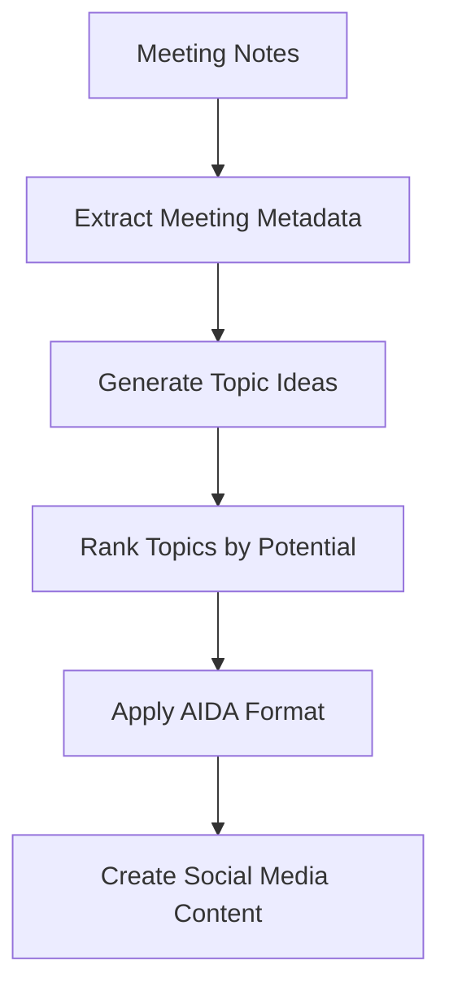

# Turn Your Meeting Notes into Gold

## *Unleash Value from Every Conversation*

How many insights from your client meetings are collecting dust in forgotten notes? For developers, AI practitioners, and entrepreneurs, those meeting notes contain hidden gold mines of content, ideas, and opportunities. Yet most of us never excavate this value, leaving potential blog posts, social media content, and market insights buried in text files and notebooks.

By the end of this article, you'll discover how Notegold can transform your meeting notes into a content powerhouse with minimal effort.

<!-- more -->

## What is Notegold?

[](https://github.com/cmagganas/notegold)

Notegold implements a "Content as a Flywheel" approach that makes it easy to extract insights from client meetings and turn them into high-value content. The system processes meeting notes through a modular pipeline:



Each step in the pipeline transforms your meeting notes into progressively more refined content assets, from raw meeting notes to valuable, shareable content.

## Features

- 🔄 **Modular Pipeline**: Each processing step is modular and can be customized or replaced.
- 📊 **Value Ranking**: Uses the "Value Equation" to prioritize the most impactful content ideas.
- 🎯 **AIDA Framework**: Structures content using the Attention, Interest, Desire, Action framework.
- 📱 **Multi-Platform**: Creates variations for different social media platforms.
- 📝 **Extensible**: Add new processing nodes to expand the system.

## Why Notegold Matters for AI Practitioners, Developers, and Entrepreneurs

Meeting notes represent some of your most valuable raw material. They capture real client problems, industry insights, and solution frameworks that you've already invested time to discuss and understand.

Notegold matters because:

- **It salvages lost value** from content you've already created
- **It scales your expertise** by transforming one-to-one conversations into one-to-many content
- **It creates a consistent content pipeline** without requiring additional creative energy
- **It prioritizes topics** based on potential value, saving you from pursuing low-impact content

For technical professionals especially, the system bridges the gap between your domain expertise and effective content marketing.

## Imagine Your Content Flywheel in Action

Picture this: You finish a client meeting and spend 5 minutes cleaning up your notes. Instead of filing them away forever, you run them through Notegold with a simple command:

```bash
make process NOTES=path/to/meeting_notes.txt
```

Within minutes, you have:

- Five ranked topic ideas extracted from the meeting
- A fully formatted blog post outline using the AIDA framework
- Social media post variations for LinkedIn, Twitter, and other platforms
- All content organized in a structured directory for easy access

That single meeting now powers your content strategy for the week. While competitors struggle to create original content, you're sharing valuable insights directly sourced from real client conversations.

The modular pipeline means you can customize each step. Need more technical content? Adjust the topic generator. Want different formatting? Modify the AIDA module. The system grows with your needs.

## How to Get Started with Notegold Today

Ready to transform your meeting notes into valuable content? Here's how to begin:

1. **Clone the repository**:

   ```bash
   git clone https://github.com/cmagganas/notegold.git
   cd notegold
   ```

2. **Set up your environment**:

   ```bash
   make setup
   export OPENAI_API_KEY=your_api_key_here
   ```

## Easy Start

For first-time users, Notegold offers an interactive start mode:

```bash
# Run in interactive mode for guided setup
notegold start
```

This will prompt you for:

- Path to your meeting notes file
- Optional meeting ID
- Optional output directory

Follow the prompts to quickly process your meeting notes.

Notegold is fully functional but could benefit from developer contributions and support. If you're a developer interested in content generation systems, this open-source project offers an excellent opportunity to contribute to a practical AI application that solves a real business problem.

Visit [the Notegold GitHub repository](https://github.com/cmagganas/notegold) to learn more, star the project, or contribute to its development. Turn your meeting notes into gold, and never let valuable insights go to waste again!
